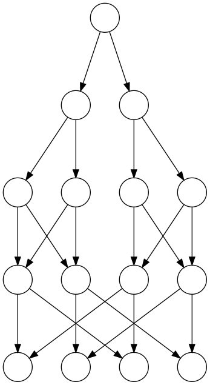
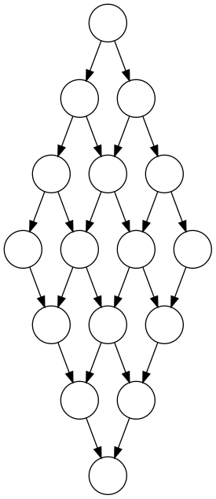

# scheduling-graphs

Instances of the Multiprocessor Scheduling Problem used in our paper:

T. I. Carvalho, B. W. Dantas Morais and G. M. Barbosa Oliveira, "Bio-Inspired and Heuristic Methods Applied to a Benchmark of the Task Scheduling Problem," 2018 7th Brazilian Conference on Intelligent Systems (BRACIS), Sao Paulo, 2018, pp. 516-521.
https://www.doi.org/10.1109/BRACIS.2018.00095


## Formatting

- The number of vertices n is given in the filename, e.g.: lap**36**.txt

- The first n lines are the respective weights of the n vertices, where vertex indexes start at 0.

- The following line defines the number of edges e.

- The following e lines contain the definition of each directed edge in the format:
    ```
    v1 v2 weight
    ```


## Graph layouts

The FFT (fast Fourier transform) and LAP (Laplace equation solver) general graph layouts are illustrated respectively as follows.

 